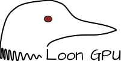

# Loon GPU

A bindless wrapper for Vulkan and Metal, targetting modern GPUs.

The API design is inspired by Sebastian Aaltonen's blog post [No Graphics API](https://www.sebastianaaltonen.com/blog/no-graphics-api), adapted to the realities of what is possible in Vulkan today. 

Currently it targets a roughly Vulkan 1.3 feature set, with a couple of required features:
- Dynamic Rendering
- Buffer Device Addresses
- Timeline Semaphores
- Descriptor Indexing

The project is designed to be built with cmake, and should be self-contained (all dependencies are either vendored or downloaded by cmake via FetchContent). We also aim to use minimal STL headers to minimize compile times when possible.

## Prequisites

The library should be entirely self-contained. The Vulkan SDK is recommended for development but not required - we pull down the necessary headers via cmake.

Building with `LOON_GPU_BUILD_DOCS=YES` requires Doxygen installed on your system. On windows, `winget install doxygen` is enough to get it working. On MacOS, `brew install doxygen` should work.

If you have the VulkanSDK installed on MacOS, you can use `LOON_GPU_USE_KOSMICKRISP=YES` to enable the Vulkan backend. 

## Quick start

If you're a Visual Studio user, you should be able to clone the repo and open the directory, and build/run from Visual Studio directly.

On Windows, run from a 64-bit Visual Studio Command Prompt, and use MSVC, or have Clang available on the PATH.

`git clone https://github.com/rkevingibson/loon_gpu.git`
`cd loon_gpu`
`mkdir build && cd build`
`cmake .. --preset "Development Windows MSVC"`
`cmake --build .`

On Mac OS, the same instructions should work but with the "Development MacOS" preset.

While the library should build for linux, it is not tested and currently there is no example framework for linux. I hope to add this in the future.

## Running examples

The build should produce a `loon_gpu_examples(.exe)` executable, which can be run from the command line. Use the `M/N` keys to cycle between different examples.

## Documentation

There is Doxygen-generated documentation built by default. I currently am not hosting the documentation anywhere, but it should appear in `<build dir>/docs/html/index.html`.